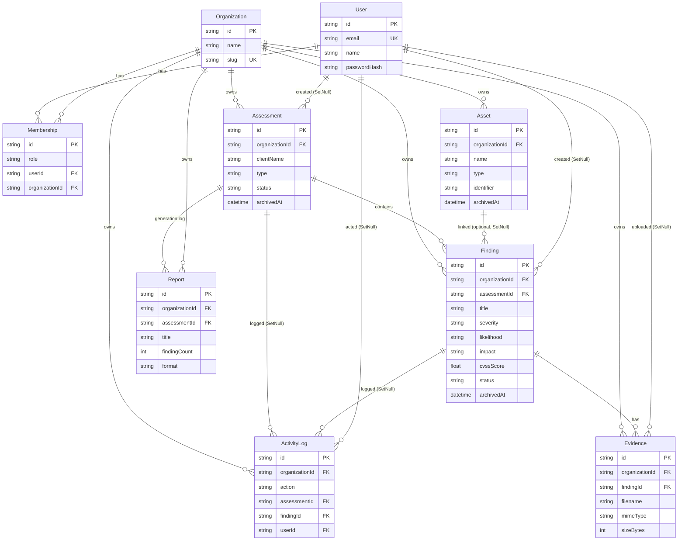

# JectarOne Portal — Entity Relationship Diagram

## Cascade / tenancy rules
- Every tenant table carries `organizationId`; all queries filter by it (cross-tenant access is impossible).
- **Cascade delete:** delete an Organization → its Memberships, Assessments, Findings, Evidence, ActivityLogs go. Delete an Assessment → its Findings + their Evidence go. Delete a Finding → its Evidence goes.
- **SetNull (audit preserved):** `createdBy` / `uploadedBy` on records, and `assessmentId` / `findingId` / `userId` on ActivityLog, become null instead of deleting the log — the audit trail survives.

## Risk model
`Risk = Likelihood × Impact` on a 5×5 matrix (each axis VeryLow…VeryHigh → 1…5). Score 1–25 banded: ≥20 Critical, ≥12 High, ≥6 Medium, ≥3 Low, else VeryLow.

## PDF reports (Sprint 4)
`Report` rows are an **audit log only** — the PDF itself is never stored as a blob. Each
download (`GET /dashboard/assessments/[id]/report`) re-queries current, non-archived
findings and renders fresh via `@react-pdf/renderer`, so the export can never drift from
what's actually in the database. `Asset` is additive: `Finding.assetId` is nullable and
`SetNull` on delete, so removing an asset never deletes or corrupts its findings.
